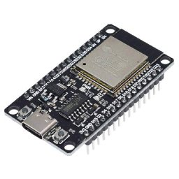
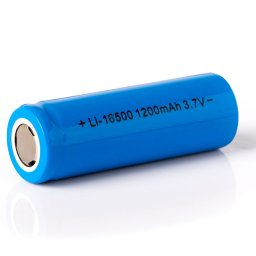

# GT3 Steering Wheel (bluetooth)

This code will allow to make a bluetooth GT3 steering wheel.

# Features

- [x] Bluetooth
- [x] Rechargeble Battery
- [x] 10 Buttons
- [x] 2 Peddle shifters
- [x] 2 Encoders with buttons

# Requirements

- 1x ESP32 With Bluetooth

  

- 1x Charger Module TP4056 USB-C

  

- 1x 3.7v Rechargeable Lithium Battery

  

- 1x Switch On/Off

  

- 1x LED 3.3v

  

- 10X 12mm Buttons

  

- 2x Encoder with Button EC11

  

- 2x Micro Switchs

  

# Dependencies

You will need install in your Arduino the library below:

- ESP32-BLE-Gamepad
- NimBLE-Arduino

# Wiring

This is just a wiring suggestion, you can customize and change in pin definitions.

If you are going to use this wiring suggestion it will just be `plug-n-play` with the current code.

Example

# Firmware

Just change pin values if you have used a different wiring, select the board `ESP32 Dev Module` and upload the firmware.

# 3D Print Parts

I did a remix from another remix from Formula B1.

I needed to remix it to add:

- Hole for switch on/off
- Bed for charger module
- Holes resized for encoders
- Holes for LEDs

**My Remix:**
https://www.printables.com/model/1306908-formula-b1-remix-esp32-bluetooth

**Remixed from:**
https://www.printables.com/model/74032-formula-b1-remix-arduino-pro-micro

**Original Model:**
https://www.thingiverse.com/thing:4058270
